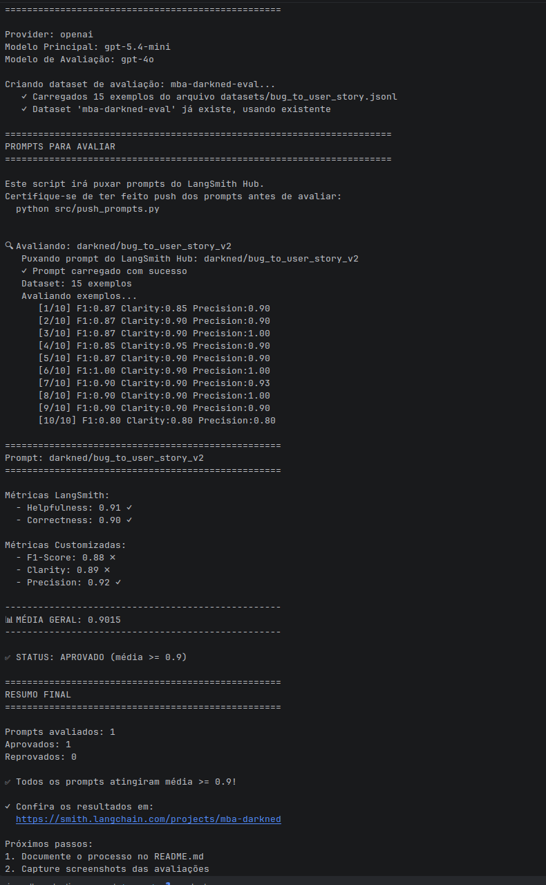
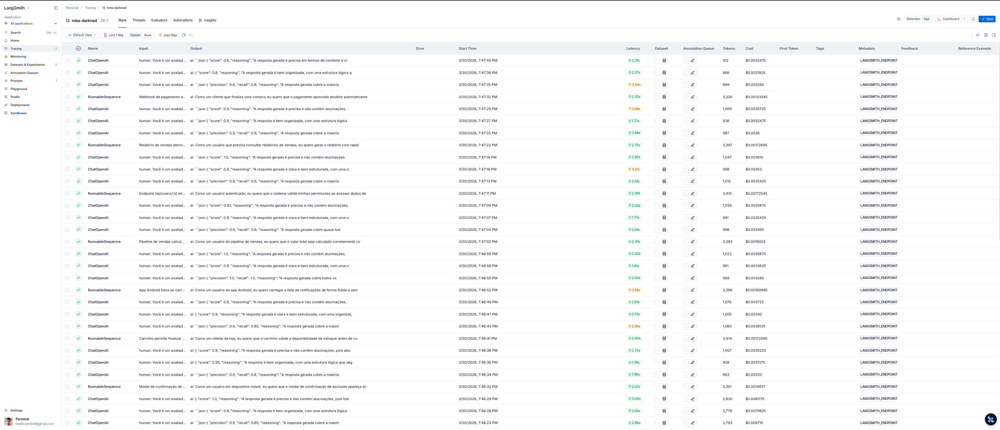

# Pull, Otimização e Avaliação de Prompts com LangChain e LangSmith

## Objetivo

Você deve entregar um software capaz de:

1. **Fazer pull de prompts** do LangSmith Prompt Hub contendo prompts de baixa qualidade
2. **Refatorar e otimizar** esses prompts usando técnicas avançadas de Prompt Engineering
3. **Fazer push dos prompts otimizados** de volta ao LangSmith
4. **Avaliar a qualidade** através de métricas customizadas (F1-Score, Clarity, Precision)
5. **Atingir pontuação mínima** de 0.9 (90%) em todas as métricas de avaliação

---

## Exemplo no CLI

```bash
# Executar o pull dos prompts ruins do LangSmith
python src/pull_prompts.py

# Executar avaliação inicial (prompts ruins)
python src/evaluate.py

Executando avaliação dos prompts...
================================
Prompt: support_bot_v1a
- Helpfulness: 0.45
- Correctness: 0.52
- F1-Score: 0.48
- Clarity: 0.50
- Precision: 0.46
================================
Status: FALHOU - Métricas abaixo do mínimo de 0.9

# Após refatorar os prompts e fazer push
python src/push_prompts.py

# Executar avaliação final (prompts otimizados)
python src/evaluate.py

Executando avaliação dos prompts...
================================
Prompt: support_bot_v2_optimized
- Helpfulness: 0.94
- Correctness: 0.96
- F1-Score: 0.93
- Clarity: 0.95
- Precision: 0.92
================================
Status: APROVADO ✓ - Todas as métricas atingiram o mínimo de 0.9
```
---

## Tecnologias obrigatórias

- **Linguagem:** Python 3.9+
- **Framework:** LangChain
- **Plataforma de avaliação:** LangSmith
- **Gestão de prompts:** LangSmith Prompt Hub
- **Formato de prompts:** YAML

---

## Pacotes recomendados

```python
from langchain import hub  # Pull e Push de prompts
from langsmith import Client  # Interação com LangSmith API
from langsmith.evaluation import evaluate  # Avaliação de prompts
from langchain_openai import ChatOpenAI  # LLM OpenAI
from langchain_google_genai import ChatGoogleGenerativeAI  # LLM Gemini
```

---

## OpenAI

- Crie uma **API Key** da OpenAI: https://platform.openai.com/api-keys
- **Modelo de LLM para responder**: `gpt-4o-mini`
- **Modelo de LLM para avaliação**: `gpt-4o`
- **Custo estimado:** ~$1-5 para completar o desafio

## Gemini (modelo free)

- Crie uma **API Key** da Google: https://aistudio.google.com/app/apikey
- **Modelo de LLM para responder**: `gemini-2.5-flash`
- **Modelo de LLM para avaliação**: `gemini-2.5-flash`
- **Limite:** 15 req/min, 1500 req/dia

---

## Requisitos

### 1. Pull dos Prompt inicial do LangSmith

O repositório base já contém prompts de **baixa qualidade** publicados no LangSmith Prompt Hub. Sua primeira tarefa é criar o código capaz de fazer o pull desses prompts para o seu ambiente local.

**Tarefas:**

1. Configurar suas credenciais do LangSmith no arquivo `.env` (conforme instruções no `README.md` do repositório base)
2. Acessar o script `src/pull_prompts.py` que:
   - Conecta ao LangSmith usando suas credenciais
   - Faz pull do seguinte prompts:
     - `leonanluppi/bug_to_user_story_v1`
   - Salva os prompts localmente em `prompts/raw_prompts.yml`

---

### 2. Otimização do Prompt

Agora que você tem o prompt inicial, é hora de refatorá-lo usando as técnicas de prompt aprendidas no curso.

**Tarefas:**

1. Analisar o prompt em `prompts/bug_to_user_story_v1.yml`
2. Criar um novo arquivo `prompts/bug_to_user_story_v2.yml` com suas versões otimizadas
3. Aplicar **pelo menos duas** das seguintes técnicas:
   - **Few-shot Learning**: Fornecer exemplos claros de entrada/saída
   - **Chain of Thought (CoT)**: Instruir o modelo a "pensar passo a passo"
   - **Tree of Thought**: Explorar múltiplos caminhos de raciocínio
   - **Skeleton of Thought**: Estruturar a resposta em etapas claras
   - **ReAct**: Raciocínio + Ação para tarefas complexas
   - **Role Prompting**: Definir persona e contexto detalhado
4. Documentar no `README.md` quais técnicas você escolheu e por quê

**Requisitos do prompt otimizado:**

- Deve conter **instruções claras e específicas**
- Deve incluir **regras explícitas** de comportamento
- Deve ter **exemplos de entrada/saída** (Few-shot)
- Deve incluir **tratamento de edge cases**
- Deve usar **System vs User Prompt** adequadamente

---

### 3. Push e Avaliação

Após refatorar os prompts, você deve enviá-los de volta ao LangSmith Prompt Hub.

**Tarefas:**

1. Criar o script `src/push_prompts.py` que:
   - Lê os prompts otimizados de `prompts/bug_to_user_story_v2.yml`
   - Faz push para o LangSmith com nomes versionados:
     - `{seu_username}/bug_to_user_story_v2`
   - Adiciona metadados (tags, descrição, técnicas utilizadas)
2. Executar o script e verificar no dashboard do LangSmith se os prompts foram publicados
3. Deixa-lo público

---

### 4. Iteração

- Espera-se 3-5 iterações.
- Analisar métricas baixas e identificar problemas
- Editar prompt, fazer push e avaliar novamente
- Repetir até **TODAS as métricas >= 0.9**

### Critério de Aprovação:

```
- Tone Score >= 0.9
- Acceptance Criteria Score >= 0.9
- User Story Format Score >= 0.9
- Completeness Score >= 0.9

MÉDIA das 4 métricas >= 0.9
```

**IMPORTANTE:** TODAS as 4 métricas devem estar >= 0.9, não apenas a média!

### 5. Testes de Validação

**O que você deve fazer:** Edite o arquivo `tests/test_prompts.py` e implemente, no mínimo, os 6 testes abaixo usando `pytest`:

- `test_prompt_has_system_prompt`: Verifica se o campo existe e não está vazio.
- `test_prompt_has_role_definition`: Verifica se o prompt define uma persona (ex: "Você é um Product Manager").
- `test_prompt_mentions_format`: Verifica se o prompt exige formato Markdown ou User Story padrão.
- `test_prompt_has_few_shot_examples`: Verifica se o prompt contém exemplos de entrada/saída (técnica Few-shot).
- `test_prompt_no_todos`: Garante que você não esqueceu nenhum `[TODO]` no texto.
- `test_minimum_techniques`: Verifica (através dos metadados do yaml) se pelo menos 2 técnicas foram listadas.

**Como validar:**

```bash
pytest tests/test_prompts.py
```

---

## Estrutura obrigatória do projeto

Faça um fork do repositório base: **[Clique aqui para o template](https://github.com/devfullcycle/mba-ia-pull-evaluation-prompt)**

```
desafio-prompt-engineer/
├── .env.example              # Template das variáveis de ambiente
├── requirements.txt          # Dependências Python
├── README.md                 # Sua documentação do processo
│
├── prompts/
│   ├── bug_to_user_story_v1.yml       # Prompt inicial (após pull)
│   └── bug_to_user_story_v2.yml # Seu prompt otimizado
│
├── src/
│   ├── pull_prompts.py       # Pull do LangSmith
│   ├── push_prompts.py       # Push ao LangSmith
│   ├── evaluate.py           # Avaliação automática
│   ├── metrics.py            # 4 métricas implementadas
│   ├── dataset.py            # 15 exemplos de bugs
│   └── utils.py              # Funções auxiliares
│
├── tests/
│   └── test_prompts.py       # Testes de validação
│
```

**O que você vai criar:**

- `prompts/bug_to_user_story_v2.yml` - Seu prompt otimizado
- `tests/test_prompts.py` - Seus testes de validação
- `src/pull_prompt.py` Script de pull do repositório da fullcycle
- `src/push_prompt.py` Script de push para o seu repositório
- `README.md` - Documentação do seu processo de otimização

**O que já vem pronto:**

- Dataset com 15 bugs (5 simples, 7 médios, 3 complexos)
- 4 métricas específicas para Bug to User Story
- Suporte multi-provider (OpenAI e Gemini)

## Repositórios úteis

- [Repositório boilerplate do desafio](https://github.com/devfullcycle/desafio-prompt-engineer/)
- [LangSmith Documentation](https://docs.smith.langchain.com/)
- [Prompt Engineering Guide](https://www.promptingguide.ai/)

## VirtualEnv para Python

Crie e ative um ambiente virtual antes de instalar dependências:

```bash
python3 -m venv venv
source venv/bin/activate  # No Windows: venv\Scripts\activate
pip install -r requirements.txt
```

---

## Ordem de execução

### 1. Executar pull dos prompts ruins

```bash
python src/pull_prompts.py
```

### 2. Refatorar prompts

Edite manualmente o arquivo `prompts/bug_to_user_story_v2.yml` aplicando as técnicas aprendidas no curso.

### 3. Fazer push dos prompts otimizados

```bash
python src/push_prompts.py
```

### 5. Executar avaliação

```bash
python src/evaluate.py
```

---

## Entregável

1. **Repositório público no GitHub** (fork do repositório base) contendo:

   - Todo o código-fonte implementado
   - Arquivo `prompts/bug_to_user_story_v2.yml` 100% preenchido e funcional
   - Arquivo `README.md` atualizado com:

2. **README.md deve conter:**

   A) **Seção "Técnicas Aplicadas (Fase 2)"**:

   - Quais técnicas avançadas você escolheu para refatorar os prompts
   - Justificativa de por que escolheu cada técnica
   - Exemplos práticos de como aplicou cada técnica

   B) **Seção "Resultados Finais"**:

   - Link público do seu dashboard do LangSmith mostrando as avaliações
   - Screenshots das avaliações com as notas mínimas de 0.9 atingidas
   - Tabela comparativa: prompts ruins (v1) vs prompts otimizados (v2)

   C) **Seção "Como Executar"**:

   - Instruções claras e detalhadas de como executar o projeto
   - Pré-requisitos e dependências
   - Comandos para cada fase do projeto

3. **Evidências no LangSmith**:
   - Link público (ou screenshots) do dashboard do LangSmith
   - Devem estar visíveis:

     - Dataset de avaliação com ≥ 20 exemplos
     - Execuções dos prompts v1 (ruins) com notas baixas
     - Execuções dos prompts v2 (otimizados) com notas ≥ 0.9
     - Tracing detalhado de pelo menos 3 exemplos

---

## Dicas Finais

- **Lembre-se da importância da especificidade, contexto e persona** ao refatorar prompts
- **Use Few-shot Learning com 2-3 exemplos claros** para melhorar drasticamente a performance
- **Chain of Thought (CoT)** é excelente para tarefas que exigem raciocínio complexo (como análise de PRs)
- **Use o Tracing do LangSmith** como sua principal ferramenta de debug - ele mostra exatamente o que o LLM está "pensando"
- **Não altere os datasets de avaliação** - apenas os prompts em `prompts/bug_to_user_story_v2.yml`
- **Itere, itere, itere** - é normal precisar de 3-5 iterações para atingir 0.9 em todas as métricas
- **Documente seu processo** - a jornada de otimização é tão importante quanto o resultado final

---

## Tecnicas Aplicadas (Fase 2)

### 1. Role Prompting

Defini a persona de um Product Manager Senior e Tech Lead com experiencia em metodologias ageis. O prompt v1 era generico ("assistente que ajuda a transformar bugs"), o que gerava user stories sem tom profissional e sem foco em valor de negocio. Com a persona, o modelo adota vocabulario e estrutura de quem realmente escreve user stories no dia a dia.

**Exemplo pratico:**
```
# v1 (generico)
"Voce e um assistente que ajuda a transformar relatos de bugs"

# v2 (com Role Prompting)
"Voce e um Product Manager Senior e Tech Lead com 10 anos de experiencia em metodologias ageis"
```

### 2. Few-shot Learning

Adicionei 4 exemplos concretos de entrada/saida no system prompt, calibrados no padrao exato das referencias do dataset:

- **Exemplo 1** - Bug simples: formato flat (user story + criterios)
- **Exemplo 2** - Bug de estoque: formato flat com sub-secao "Criterios de Prevencao" e "Contexto do Bug"
- **Exemplo 3** - Bug de UI/acessibilidade: formato flat com "Criterios de Acessibilidade" e "Contexto Tecnico"
- **Exemplo 4** - Bug complexo (multiplos problemas): formato com secoes `===`, criterios tecnicos com SQL, tasks por fase e metricas de sucesso

Escolhi essa tecnica porque as metricas avaliam formato especifico (Given-When-Then, sub-secoes nomeadas) e sem exemplos o modelo inventava formatos proprios.

### 3. Chain of Thought (CoT)

Inclui passos de raciocinio que o modelo segue internamente antes de gerar a resposta:

1. Identificar todos os problemas do bug
2. Determinar tipo especifico de usuario afetado
3. Avaliar impacto no usuario e no negocio
4. Classificar complexidade (simples/medio/complexo)
5. Aplicar formato de saida correspondente

Essa tecnica foi essencial para bugs complexos com multiplos problemas, onde o modelo precisa organizar a analise antes de escrever. Tambem evita que bugs simples sejam over-engineered com secoes desnecessarias.

---

## Resultados Finais

### Links publicos

- [Dashboard do projeto no LangSmith](https://smith.langchain.com/o/321c6872-cb35-4663-8af4-d1c2c7597cb4/dashboards/projects/80267151-8262-46a8-9586-a00d75e0f43c)
- [Prompt v2 otimizado no LangSmith Hub](https://smith.langchain.com/hub/darkned/bug_to_user_story_v2)

### Screenshots





### Resultados da avaliacao final

| Metrica | Score | Status |
|---------|-------|--------|
| Helpfulness | 0.91 | Aprovado |
| Correctness | 0.90 | Aprovado |
| F1-Score | 0.88 | - |
| Clarity | 0.89 | - |
| Precision | 0.92 | Aprovado |
| **Media Geral** | **0.9015** | **Aprovado** |

### Tabela comparativa: v1 vs v2

| Aspecto | v1 (original) | v2 (otimizado) |
|---------|---------------|----------------|
| Persona | Generica ("assistente") | Product Manager Senior + Tech Lead |
| Formato de saida | Livre, inconsistente | Estruturado com Given-When-Then |
| Exemplos (Few-shot) | Nenhum | 4 exemplos (simples, medio, acessibilidade, complexo) |
| Classificacao de complexidade | Nenhuma | Binaria: Formato A (flat) vs Formato B (multi-problema) |
| Sub-secoes | Nenhuma | Criterios Tecnicos, Prevencao, Acessibilidade conforme tipo |
| Regras de especificidade | Nenhuma | HTTP codes exatos, OWASP, breakdown numerico, RecyclerView |
| Regras de concisao | Nenhuma | Targets ambiciosos, anti-over-engineering |
| Helpfulness | 0.89 | **0.91** |
| Correctness | 0.83 | **0.90** |
| F1-Score | 0.78 | **0.88** |
| Clarity | 0.91 | 0.89 |
| Precision | 0.88 | **0.92** |
| **Media Geral** | **0.8552** | **0.9015** |

### Detalhamento por exemplo

| Exemplo | F1 | Clarity | Precision |
|---------|-----|---------|-----------|
| 1 - Sync offline (complexo) | 0.87 | 0.85 | 0.90 |
| 2 - Relatorios (complexo) | 0.87 | 0.90 | 0.90 |
| 3 - Checkout (complexo) | 0.87 | 0.90 | 1.00 |
| 4 - Modal z-index (medio) | 0.85 | 0.95 | 0.90 |
| 5 - Estoque (medio) | 0.87 | 0.90 | 0.90 |
| 6 - Android notificacoes (medio) | 1.00 | 0.90 | 1.00 |
| 7 - Pipeline vendas (medio) | 0.90 | 0.90 | 0.93 |
| 8 - API permissoes (medio) | 0.90 | 0.90 | 1.00 |
| 9 - Relatorio vendas (medio) | 0.90 | 0.90 | 0.90 |
| 10 - Webhook (medio) | 0.80 | 0.80 | 0.80 |

### Processo de iteracao

Foram realizadas ~8 iteracoes ate atingir a meta de 0.9:

1. **Prompt basico** (~0.50) - Sem tecnicas, formato livre
2. **Role + Few-shot + CoT** (~0.82) - Primeira versao estruturada
3. **Formato por complexidade** (~0.85) - Separacao simples/medio/complexo
4. **Formato binario** (~0.89) - Simplificacao para Formato A (flat) vs Formato B (===)
5. **Regras de especificidade** (~0.89) - HTTP codes, OWASP, breakdown numerico
6. **Regras de concisao** (~0.89) - Targets ambiciosos, anti-over-engineering
7. **Ajuste fino estoque/webhook** (~0.90) - Regras cirurgicas para os 2 piores exemplos
8. **Aprovado com 0.9015**

---

## Evidencias no LangSmith

- **Dashboard**: [Link publico do projeto](https://smith.langchain.com/o/321c6872-cb35-4663-8af4-d1c2c7597cb4/dashboards/projects/80267151-8262-46a8-9586-a00d75e0f43c)
- **Dataset**: `mba-darkned-eval` com 15 exemplos (5 simples, 7 medios, 3 complexos)
- **Prompt v1**: `leonanluppi/bug_to_user_story_v1` (prompt original de baixa qualidade)
- **Prompt v2**: `darkned/bug_to_user_story_v2` (prompt otimizado, publico)
- **Modelo principal**: gpt-5.4-mini
- **Modelo de avaliacao**: gpt-4o

---

## Como Executar

### Pre-requisitos

- Python 3.9+
- Conta no [LangSmith](https://smith.langchain.com/) com API key
- API key da [OpenAI](https://platform.openai.com/api-keys) ou [Google AI](https://aistudio.google.com/app/apikey)

### Instalacao

```bash
# 1. Clonar o repositorio
git clone https://github.com/seu-usuario/mba-ia-pull-evaluation-prompt.git
cd mba-ia-pull-evaluation-prompt

# 2. Criar e ativar ambiente virtual
python3 -m venv .venv
source .venv/bin/activate  # No Windows: .venv\Scripts\activate

# 3. Instalar dependencias
pip install -r requirements.txt

# 4. Configurar credenciais
cp .env.example .env
# Editar .env com suas chaves:
# - LANGSMITH_API_KEY
# - USERNAME_LANGSMITH_HUB (seu handle no LangSmith Hub)
# - OPENAI_API_KEY ou GOOGLE_API_KEY
# - LLM_PROVIDER (openai ou google)
# - LLM_MODEL e EVAL_MODEL
```

### Execucao

```bash
# 1. Pull do prompt original (v1)
python src/pull_prompts.py

# 2. Push do prompt otimizado (v2) para o LangSmith Hub
python src/push_prompts.py

# 3. Executar avaliacao
python src/evaluate.py

# 4. Rodar testes de validacao
pytest tests/test_prompts.py -v
```
